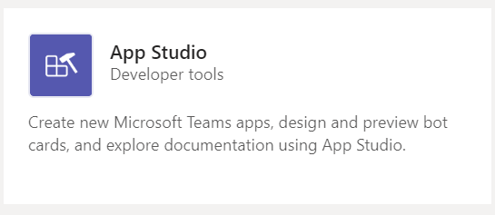
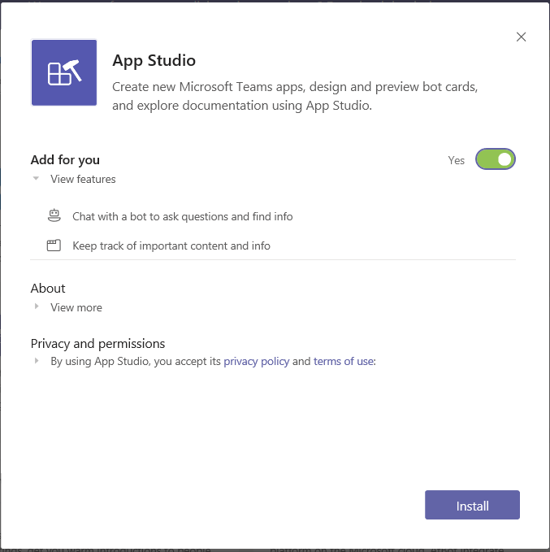
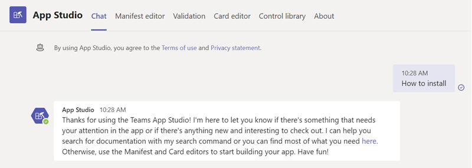
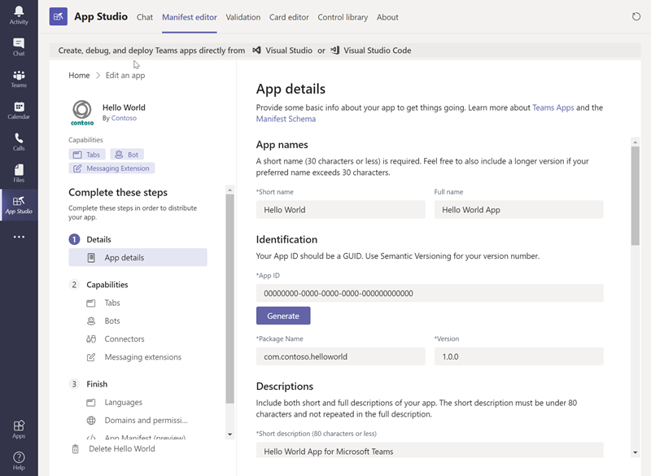

# Exercise 1: Creating an app manifest in Microsoft Teams

## Task 1: Install App Studio

App Studio is a Teams app which can be found in the Teams store. Follow this link for direct download: [App Studio](https://aka.ms/InstallTeamsAppStudio) (you can also find the app in the app store).

1. Open a browser and navigate to the [Teams web client](https://teams.microsoft.com/). Sign in using a **Work or School Account** that has global administrator rights to the tenancy.

1. Select **Apps** at the bottom of the left hand bar.

1. In the store, search for **App Studio**.

    

1. Select the **App Studio** tile to open the app install page:

    

1. Select install.

    

Once you are in **App Studio**, select the Manifest editor tab where you can either import an existing app or create a new app.

## Task 2: Configure an app manifest using App Studio

### Get sample project files

1. Open PowerShell and navigate to **C:/LabFiles/Teams**

1. To clone the sample project repository, execute the following command:

    ```powershell
    git clone https://github.com/OfficeDev/msteams-samples-hello-world-csharp.git
    ```

### Build a Teams App Package

1. From the PowerShell command prompt, change to the **C:/LabFiles/Teams/msteams-samples-hello-world-csharp** directory by executing the following command:

    ```powershell
    cd c:/LabFiles/Teams/msteams-samples-hello-world-csharp
    ```

1. Open the folder in Visual Studio Code by executing the following from the project directory: `code .`

1. If Visual Studio code displays a dialog box asking if you want to add required assets to the project, select **Yes**.

1. From the Visual Studio Code ribbon, select **Terminal > New Terminal**.

1. In the terminal, Run the following command to compile the application: `dotnet build`

1. After succesfully compiling the solution, the **helloworldapp.zip** Teams App package will be generated in the **..\\bin\\Debug\\netcoreapp3.1\\** folder.

### Import the existing package

1. Open a browser and navigate to the [Teams web client](https://teams.microsoft.com/).

1. In the app bar, select ... **More added apps** and then select **App Studio**.

1. In App Studio, select the **Manifest editor** tab, then select **Import an existing app**. Open the project's **..\\bin\Debug\netcoreapp3.1\\** folder, and then open the **helloworldapp.zip** file.

1. You should now see your imported app which you can now select to open.

### Update app manifest

Now you can modify your app manifest here in App Studio.



1. On the **App details** page, change the **Short name** of the app to **First App**, and change the **Full name** of the app to **Learn Microsoft Teams App**.

1. On the **App details** page, scroll down to the **Descriptions** section and enter the following values:

    - **Short description**: Enter **My first custom Teams app**

    - **Long description**: Enter a longer description of your choice.**

1. Change the **Version** to **1.0.1**.

1. In the App Studio navigation pane, update the tab name by selecting **Capabilities > Tabs**.

1. Locate the only personal tab in the project, and then select **... > Edit** on that tab.

1. Change the tab name to **My First Tab**.

1. Select **Save** to save your changes.

1. Now you need to download the package. The changes you make in App Studio aren't saved to your project. To update the project, download the app package from App Studio. To download the project, in the App Studio navigation pane select **Finish** > **Test and distribute**, and then select **Download**.

    **Warning**:
    Be careful if you choose to update the **manifest.json** file in your project with the one in the package downloaded from App Studio.
The manifest file in your project contains placeholder strings that are updated by the build and debugging process. 
For instance, the **{{HOSTNAME}}** placeholder is replaced with the app's hosting URL each time the package is recreated. Because of that, you may not want to completely replace the existing **manifest.json** file with the file generated by App Studio.

1. Now you need to upload your just modified app. From the Teams client, select **Apps > Upload a custom app**. 

1. Browse and upload the updated zip package. Open the app and notice it’s now reflecting the updates you made.

   

## Task 3: Deploying SPFx web part to Microsoft Teams

### Create SPFx web part

1. From the PowerShell command prompt, change to the C:/LabFiles/SharePoint directory by executing the following command: `cd c:/LabFiles/SharePoint`

1. Make a new directory for your SharePoint project files by executing the following command: `md SPFxTeamsTab`

1. Navigate to the newly created SharePoint directory by executing the following command: `cd SPFxTeamsTab`

1. Run the SharePoint Yeoman generator by executing the following command: `yo @microsoft/sharepoint`

1. Use the following to complete the prompt that is displayed:

    - **What is your solution name?**: SPFxTeamsTab

    - **Which baseline packages do you want to target for your component(s)?:** SharePoint Online only (latest)

    - **Where do you want to place the files?**: Use the current folder

    - **Do you want to allow the tenant admin the choice of being able to deploy the solution to all sites immediately without running any feature deployment or adding apps in sites?**: Yes

    - **Will the components in the solution require permissions to access web APIs that are unique and not shared with other components in the tenant?**: No

    - **Which type of client-side component to create?**: WebPart

    - **What is your Web Part name?**: SPFx Teams Together

    - **What is your Web Part description?**: SPFx Teams Together description

    - **Which framework would you like to use?**: No JavaScript framework

1. After provisioning the folders required for the project, the generator will install all the dependency packages using NPM.

1. Open the project in an editor such as Visual Studio Code.

1. Enable the web part to be used in Microsoft Teams:

    1. Locate and open the file **./src/webparts/spFxTeamsTogether/SpFxTeamsTogetherWebPart.manifest.json**.

    1. Within the web part manifest file, locate the property **supportedHosts**: `"supportedHosts": ["SharePointWebPart"],`

    1. Add another option to enable this web part to be used as a tab in a Microsoft Teams team: `"supportedHosts": ["SharePointWebPart", "TeamsTab"],`

### Creating and deploying the Microsoft Teams app package

1. Create a **manifest.json** file in **./teams** folder, use the following manifest file as a template:

    ```json
    {
        "$schema": "https://developer.microsoft.com/json-schemas/teams/v1.5/MicrosoftTeams.schema.json",
        "manifestVersion": "1.5",
        "packageName": "{{SPFX_COMPONENT_ALIAS}}",
        "id": "{{SPFX_COMPONENT_ID}}",
        "version": "0.1",
        "developer": {
            "name": "Parker Porcupine",
            "websiteUrl": "https://contoso.com",
            "privacyUrl": "https://contoso.com/privacystatement",
            "termsOfUseUrl": "https://contoso.com/servicesagreement"
        },
        "name": {
            "short": "{{SPFX_COMPONENT_NAME}}"
        },
        "description": {
            "short": "{{SPFX_COMPONENT_SHORT_DESCRIPTION}}",
            "full": "{{SPFX_COMPONENT_LONG_DESCRIPTION}}"
        },
        "icons": {
            "outline": "{{SPFX_COMPONENT_ID}}_outline.png",
            "color": "{{SPFX_COMPONENT_ID}}_color.png"
        },
        "accentColor": "#004578",
        "staticTabs": [
            {
            "entityId": "com.contoso.personaltab.spfx",
            "name": "My SPFx Personal Tab",
            "contentUrl": "https://{teamSiteDomain}/_layouts/15/TeamsLogon.aspx?SPFX=true&dest=/_layouts/15/teamshostedapp.aspx%3Fteams%26personal%26componentId={{SPFX_COMPONENT_ID}}%26forceLocale={locale}",
            "scopes": [
                "personal"
            ]
            }
        ],
        "configurableTabs": [
            {
            "configurationUrl": "https://{teamSiteDomain}{teamSitePath}/_layouts/15/TeamsLogon.aspx?SPFX=true&dest={teamSitePath}/_layouts/15/teamshostedapp.aspx%3FopenPropertyPane=true%26teams%26componentId={{SPFX_COMPONENT_ID}}%26forceLocale={locale}",
            "canUpdateConfiguration": true,
            "scopes": [
                "team"
            ]
            }
        ],
        "validDomains": [
            "*.login.microsoftonline.com",
            "*.sharepoint.com",
            "spoprod-a.akamaihd.net",
            "resourceseng.blob.core.windows.net"
        ],
        "webApplicationInfo": {
            "resource": "https://{teamSiteDomain}",
            "id": "00000003-0000-0ff1-ce00-000000000000"
        }
    }
    ```

1. Open the **manifest.json** file. This file contains multiple strings that need to be updated to match the SPFx component. Use the following table to determine the values that should be replaced. The SPFx component properties are found in the web part manifest file: **./src/webparts/spFxTeamsTogether/SpFxTeamsTogetherWebPart.manifest.json**
    | **manifest.json string**| **Property in SPFx component manifest**|
    | :--- | :--- |
    | {{SPFX_COMPONENT_ALIAS}}| alias|
    | {{SPFX_COMPONENT_NAME}}| preconfiguredEntries[0].title|
    | {{SPFX_COMPONENT_SHORT_DESCRIPTION}}| preconfiguredEntries[0].description|
    | {{SPFX_COMPONENT_LONG_DESCRIPTION}}| preconfiguredEntries[0].description|
    | {{SPFX_COMPONENT_ID}}| id|

    **Note**:
    Don't miss replacing **{{SPFX_COMPONENT_ID}}** in **configurableTabs[0].configurationUrl**. You will likely have to scroll your editor to the right to see it. The tokens surrounded by single curly braces (for example, **{teamSiteDomain}**) do not need to be replaced.


1. Create a Microsoft Teams app package by zipping the contents of the **./teams** folder. Make sure to zip just the contents and not the folder itself. This ZIP archive should contain three files at the root: two images and the **manifest.json**.

### Create and deploy the SharePoint package

1. Open a browser and navigate to your SharePoint Online Tenant-Scoped App Catalog site.

1. Select the menu item **Apps for SharePoint** from the left navigation menu.

1. Build the project by opening a command prompt and changing to the root folder of the project. Then execute the following command: `gulp build`

1. Next, create a production bundle of the project by running the following command on the command line from the root of the project: `gulp bundle --ship`

1. Create a deployment package of the project by running the following command on the command line from the root of the project: `gulp package-solution --ship`

1. Locate the file created by the gulp task, found in the **./sharepoint/solution** folder with the name *.sppkg.

1. Drag this file into **the Apps for SharePoint** library in the browser.

1. In the **Do you trust...?** dialog box, select the check box **Make this solution available to all sites in the organization** and then select **Deploy**.

1. This will make the SPFx web part available to all site collections in the tenant, including those that are behind a Microsoft Teams team.

### Testing the SPFx web part in Microsoft Teams

1. Create a new Microsoft Teams team.

    1. Using the same browser where you are signed in to SharePoint Online, navigate to [https://teams.microsoft.com](https://teams.microsoft.com/). When prompted, load the web client.

    1. If you do not have any teams in your tenant, you will be presented with the following dialog. Otherwise, select **Join or create a team** at the bottom of the list of teams.

    1. On the **Create your team** dialog box, select **Build a team from scratch**.

    1. On the **What kind of team will this be?** dialog box, select **Public**.

    1. When prompted, use the name **My First Team**.

1. Install the Microsoft Teams application as a new tab that will expose the SharePoint Framework web part in Microsoft Teams:

    1. Select the **My First Team** team previously created.

    1. Select the **General** channel.

1. Add a custom tab to the team using the SPFx web part:

    1. At the top of the page, select the **+** icon in the horizontal navigation.

    1. In the **Add a tab** dialog box, select **More Apps**.

    1. Select the **Upload a custom app** > **Upload for ...** from the list of app categories.

    1. Select the Microsoft Teams application ZIP file previously created. This is the file that contains the **manifest.json** and two image files.

        **Note**:
        After a moment, the application will appear next to your tenant name. You may need to refresh the page for the app to appear if you are using the browser Microsoft Teams client.

1. Select the **SPFx Teams Together** app.

1. In the **SPFx Teams Together** dialog box, select **Add to a team**.

1. In the **Select a channel to start using SPFx Teams Together** dialog box, make sure that the **General** channel is selected and select **Set up a tab**.

1. The next dialog box will confirm the installation of the app. Select **Save**.

1. The application should now load in Microsoft Teams within the **General** channel under the tab **SPFx Teams Together**.

## Review

In this exercise, you:

- Installed App Studio app in Teams.
- Configured and updated app manifest.
- Deployed a SPFx web part to Microsoft Teams.
