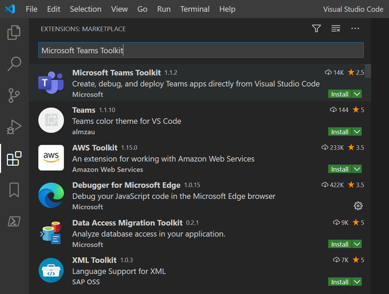
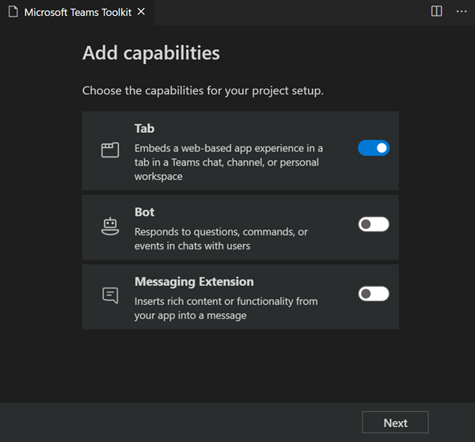
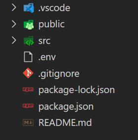
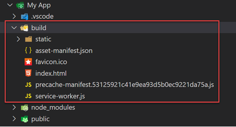
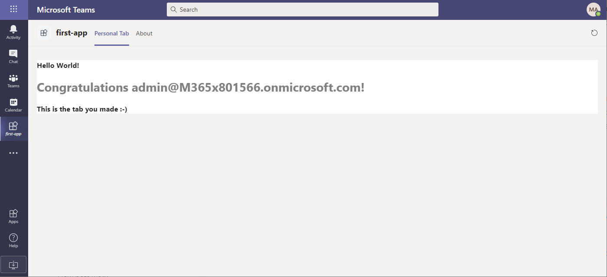

# Exercise 2: Deploying a Microsoft Teams app

## Task 1: Setup Environment for Teams development

### Install your development tools

You can build Teams apps with your preferred tools, but these lessons show how you can get started quickly with the Microsoft Teams Toolkit for Visual Studio Code.

1. Open Visual Studio Code and select **Extensions** on the left Activity Bar.

2. Search **Microsoft Teams Toolkit** on the extensions panel and install the **Microsoft Teams Toolkit**.

    

## Task 2: Use the Microsoft Teams Toolkit in Visual Studio Code to set up your first app project

1. In Visual Studio Code, select **Microsoft Teams** on the left Activity Bar and choose **Create a new Teams app**.

    

1. When prompted, sign in with your Microsoft 365 development account.

1. On the **Add capabilities** screen, select **Tab** then Next.

    

1. Enter a name for your Teams app. (This is the default name for your app and also the name of the app project directory on your local machine.)

1. Check only the **Personal tab** option and select **Finish** at the bottom of the screen to configure your project.

### Review the generated solution

Once the toolkit configures your project, you have the components to build a basic personal tab for Teams. The project directories and files display in the Explorer area of Visual Studio Code.



The toolkit automatically creates scaffolding for you in the src directory based on the capabilities you added during setup.

If you create a tab during setup, for example, the **App.js** file in the **src/components** directory is important because it handles the initialization and routing of your app. It calls the [Microsoft Teams SDK](https://docs.microsoft.com/en-us/microsoftteams/platform/tabs/how-to/using-teams-client-sdk) to establish communication between your app and Teams.

#### App ID

Your Teams app ID is needed to configure your app with App Studio. You can find the ID in the **teamsAppId** object, which is located in your project's **package.json** file.

### Build and run your app

Your Tab will be located in the **./src/components/Tab.js** file. This is the TypeScript React based class for your Tab. Locate the **render()** method and observe the code inside the `<div>` tag.

```typescript
        <div>
            <h3>Hello World!</h3>
            <h1>Congratulations {userName}!</h1>
            <h3>This is the tab you made :-)</h3>
        </div>
```

1. Open Terminal in Visual Studio Code. From the Visual Studio Code ribbon select **Terminal > New Terminal**.

1. Go to the root directory of your app project and run `npm install`.

1. To build your solution you use the `npm run build` command.

    1. This will transpile your solution into the **./build** folder.

        

### Run your app

To run your app you use the `npm start` command. This will build and start a local web server for you to test your app. The command will also rebuild the application whenever you save a file in your project.

Once complete, there's a Compiled successfully! message in the terminal. Your app is running on **https://localhost:3000**.

## Task 3: Sideload an app in Microsoft Teams

Now that you’ve tested your tab, it’s time to run your app inside Microsoft Teams.

1. In Visual Studio Code, press the **F5** key to launch a Teams web client.

1. To display your app content in Teams, specify that where your app is running (localhost) is trustworthy:

   1. Open a new tab in the same browser window (Google Chrome by default) which opened after pressing **F5**.

   1. Go to [https://localhost:3000/tab](https://localhost:3000/tab) and proceed to the page.

1. Go back to Teams. In the dialog, select **Add for me** to install your app.

    

## Review

In this exercise, you:

- Utilized Microsoft Teams Toolkit to creates scaffolding and reviewed the result.

- Built and ran a Teams Tab app in Teams.
