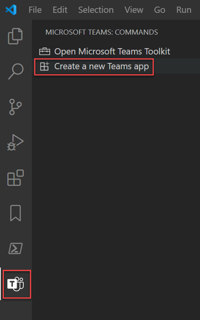
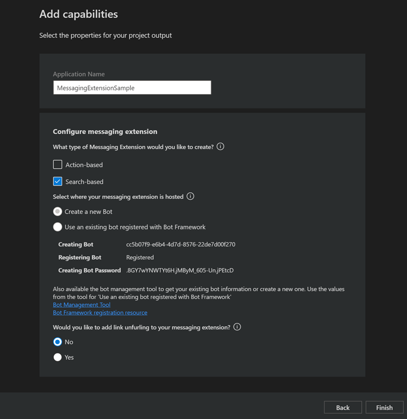
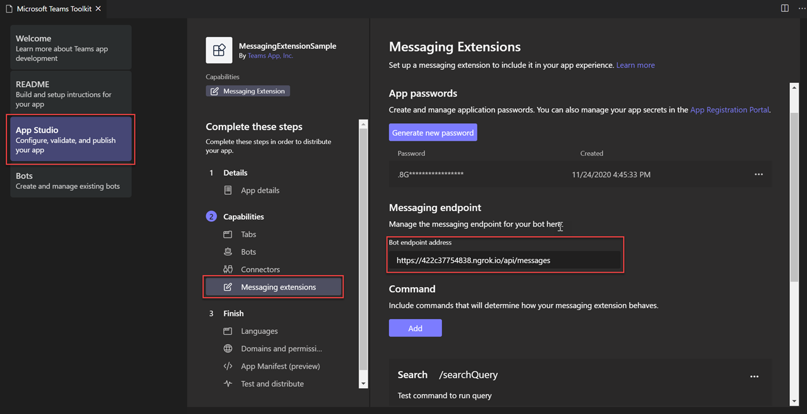

# Exercise 6: Creating messaging extensions in Microsoft Teams

Messaging extensions allow users to interact with your web service through buttons and forms in the Microsoft Teams client. They can search, or initiate actions, in an external system from the compose message area, the command box, or directly from a message. You can then send the results of that interaction back to the Microsoft Teams client, typically in the form of a richly formatted card

## Task 1: Create a search-based messaging extension

Search commands allow your users to search an external system for information (either manually through a search box, or by pasting a link to a monitored domain into the compose message area), then insert the results of the search into a message.

### Create your search-based messaging extension project

1. In **Visual Studio Code**, select **Microsoft Teams** on the left Activity Bar and choose **Create a new Teams app**.

    

1. When prompted, sign in with your Microsoft 365 development account.

1. On the **Add capabilities** screen, select **Messaging Extension** then Next.

1. Select the properties for your project.

   - Enter a name for your Teams app. (This is the default name for your app and also the name of the app project directory on your local machine.)
  
   - Check only the **Search-based** option in **Configure messaging extension** section.

   - Select **Create Bot Registration** to create a new bot.

  

1. Select **Finish** at the bottom of the screen to configure your project.

1. Open **botActivityHandler** to locate `async handleTeamsMessagingExtensionQuery(context, query)` method, the web service will receive a **composeExtension/query** invoke message that contains a **value** object with the search parameters. This invoke is triggered:

   - As characters are entered into the search box.

   - If **initialRun** is set to true in your app manifest, you'll receive the invoke message as soon as the search command is invoked.

### Run Ngrok for the search-based messaging extension

1.The first step is to open a command prompt to execute the following commands.

    ```powershell
    ngrok http -host-header=rewrite 3978
    ```

   This will start ngrok and will tunnel requests from an external ngrok url to your development machine on port 3978. Copy the https forwarding address. In the example below that would be https://787b8292.ngrok.io. You will need this later.

### Update Bot Framework Messaging Endpoint for the search-based messaging extension

1. Return to Visual Studio code and select **App Studio** in **Microsoft Teams Toolkit**.

1. When prompted, sign in with your Microsoft 365 development account.

1. Select **Messaging Extension** in left menu.

1. For the **Messaging endpoint URL**, use the current https URL you were given by running ngrok and append it with the path /api/messages. It should like something work `https://{subdomain}.ngrok.io/api/messages`.

   

### Build and run the search-based messaging extension

1. Open Terminal in Visual Studio Code. From the Visual Studio Code ribbon select **Terminal > New Terminal**.

1. Go to the root directory of your app project and run `npm install`.

1. Run `npm start`.

### Deploy the search-based messaging extension to Teams

1. Start debugging the project by selecting the **F5** key or select the debug icon in Visual Studio Code and select the **Start Debugging** (green arrow) button.

1. Go back to Teams. In the dialog, select **Add for me** to install your app.

Well done, You have a search-based Messaging Extensions for searching the registry for packages matching the search terms.

## Task 2: Create an action-based messaging extension

Action commands allow you to present your users with a modal popup to collect or display information. When they submit the form, your web service can respond by inserting a message into the conversation directly, or by inserting a message into the compose message area and allowing the user to submit the message. You can even chain multiple forms together for more complex workflows.

1. In **Visual Studio Code**, select **Microsoft Teams** on the left Activity Bar and choose **Create a new Teams app**.

1. When prompted, sign in with your Microsoft 365 development account.

1. On the **Add capabilities** screen, select **Messaging Extension** then Next.

1. Select the properties for your project.

   - Enter a name for your Teams app. (This is the default name for your app and also the name of the app project directory on your local machine.)
  
   - Check only the **Action-based** option in **Configure messaging extension** section.

   - Select **Create Bot Regisstration** to create a new bot.

1. Select **Finish** at the bottom of the screen to configure your project.

### Run Ngrok for the action-based messaging extension

1.The first step is to open a command prompt to execute the following commands.

    ```powershell
    ngrok http -host-header=rewrite 3978
    ```

   This will start ngrok and will tunnel requests from an external ngrok url to your development machine on port 3978. Copy the https forwarding address. In the example below that would be https://787b8292.ngrok.io. You will need this later.

### Update Bot Framework Messaging Endpoint for the action-based messaging extension

1. Return to Visual Studio code and select **App Studio** in **Microsoft Teams Toolkit**.

1. When prompted, sign in with your Microsoft 365 development account.

1. Select **Messaging Extension** in left menu.

1. For the **Messaging endpoint URL**, use the current https URL you were given by running ngrok and append it with the path /api/messages. It should like something work `https://{subdomain}.ngrok.io/api/messages`.

### Build and run the action-based messaging extension

1. Open Terminal in Visual Studio Code. From the Visual Studio Code ribbon select **Terminal > New Terminal**.

1. Go to the root directory of your app project and run `npm install`.

1. Run `npm start`.

### Deploy the action-based messaging extension to Teams

1. Start debugging the project by selecting the **F5** key or select the debug icon in Visual Studio Code and click the **Start Debugging** green arrow button.

1. Go back to Teams. In the dialog, select **Add for me** to install your app.

Well done, You have a action-based Messaging Extensions for submitting a compose message to your bot.

## Review

In this exercise, you:

- Created a search-based messaging extension.

- Created a action-based messaging extension project.
