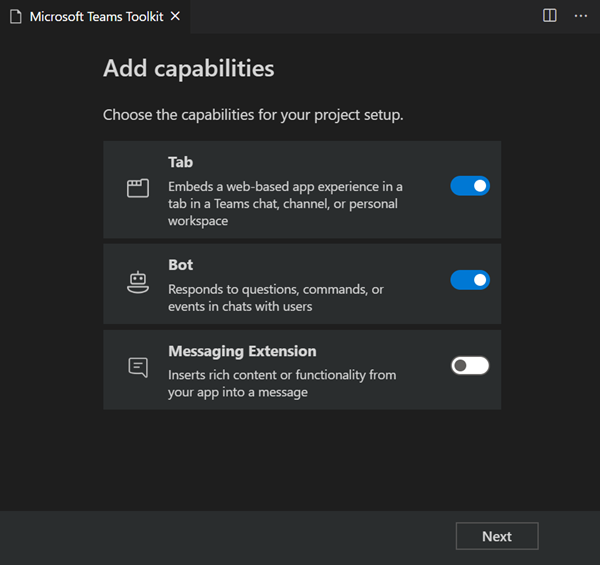
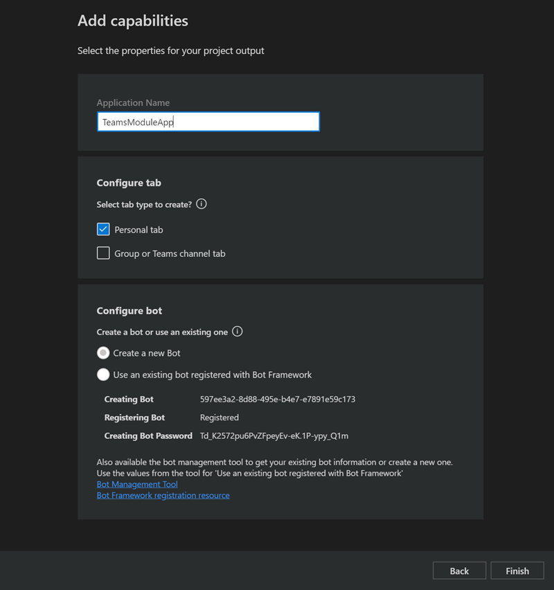

# Exercise 3: Creating and using task modules in Microsoft Teams

Task modules allow you to create modal popup experiences in your Teams application. Inside the popup you can run your own custom HTML/JavaScript code, show an \<iframe\>-based widget such as a YouTube or Microsoft Stream video or display an [Adaptive card](https://docs.microsoft.com/en-us/adaptive-cards/).

Firstly, we need to create a Teams application for displaying Task modules.

1. Open Visual Studio Code and select **Extensions** on the left Activity Bar.

1. Select **Microsoft Teams** on the left Activity Bar and choose **Create a new Teams app**.

    

1. When prompted, sign in with your Microsoft 365 development account.

1. On the **Add capabilities** screen, select **Tab** and **Bot** then Next.

    

1. Enter a name for your Teams app. (This is the default name for your app and also the name of the app project directory on your local machine.)

1. Check the **Personal tab** option in **Configure tab** section.

1. Select the **Create Bot Registration** button to register a bot in **Configure bot** section.

    

1. Select **Finish** at the bottom of the screen to configure your project.

## Task 1: Create a card-based task module

Cards are actionable snippets of content that you can add to a conversation through a bot, a connector, or app. Using text, graphics, and buttons, cards allow you to communicate with an audience. we will create a simple Adaptive Card to Teams Tab app project.

1. From Visual Studio Code, open the **Tab.js** file in the **..\\tabs\\src\\components\\** folder.

1. Locate the method **render()** add the following functions before it.

    ```typescript
    showCardBasedTaskModule() {
        let cardJson = {
        contentType: "application/vnd.microsoft.card.adaptive",
        content: {
            type: "AdaptiveCard",
            body: [
            {
                type: "TextBlock",
                text: "Here is a ninja cat:",
            },
            {
                type: "Image",
                url: "https://adaptivecards.io/content/cats/1.png",
                size: "Medium",
            },
            ],
            version: "1.0",
        },
        };

        let taskInfo = {
        title: null,
        height: 510,
        width: 430,
        url: null,
        card: cardJson,
        fallbackUrl: null,
        completionBotId: null,
        };

        microsoftTeams.tasks.startTask(taskInfo, (err, result) => {
        console.log(`Submit handler - err: ${err}`);
        });
    }
    ```

1. Continue to locate the method **render()** and update the contents to match the following code.

    ```typescript
        render() {
            return (
            <div>
                <button onClick={this.showCardBasedTaskModule}>ShowCard</button>
            </div>
            );
        }
    ```

Now, a card-based task module has been added to the Teams Tab app.

## Task 2: Create an iframe-based task module

1. From Visual Studio Code, Create a folder named **models** in the **service** folder.

1. Follow the below steps to create 4 script files in the **models** folder.

    1. Create a file named **taskmoduleids.js**, and then copy the following code to the file.

        ```typescript
        const TaskModuleIds = {
            YouTube: 'YouTube',
            AdaptiveCard: 'AdaptiveCard'
        };

        module.exports.TaskModuleIds = TaskModuleIds;
        ```

    1. Create a file named **taskmoduleresponsefactory.js**, and then copy the following code to the file.

        ```typescript
        class TaskModuleResponseFactory {
            static createResponse(taskModuleInfoOrString) {
                if (typeof taskModuleInfoOrString === 'string') {
                    return {
                        task: {
                            type: 'message',
                            value: taskModuleInfoOrString
                        }
                    };
                }

                return {
                    task: {
                        type: 'continue',
                        value: taskModuleInfoOrString
                    }
                };
            }

            static toTaskModuleResponse(taskInfo) {
                return TaskModuleResponseFactory.createResponse(taskInfo);
            }
        }

        module.exports.TaskModuleResponseFactory = TaskModuleResponseFactory;
        ```

    1. Create a file named **taskmoduleuiconstants.js**, and then copy the following code to the file.

        ```typescript
        const { UISettings } = require('./uisettings');
        const { TaskModuleIds } = require('./taskmoduleids');

        const TaskModuleUIConstants = {
            YouTube: new UISettings(1000, 700, 'YouTube Video', TaskModuleIds.YouTube, 'YouTube'),
            AdaptiveCard: new UISettings(400, 200, 'Adaptive Card: Inputs', TaskModuleIds.AdaptiveCard, 'Adaptive Card')
        };

        module.exports.TaskModuleUIConstants = TaskModuleUIConstants;
        ```

    1. Create a file named **uisettings.js**, and then copy the following code to the file.

        ```typescript
        class UISettings {
            constructor(width, height, title, id, buttonTitle) {
                this.width = width;
                this.height = height;
                this.title = title;
                this.id = id;
                this.buttonTitle = buttonTitle;
            }
        }

        module.exports.UISettings = UISettings;
        ```

1. Create a folder named **pages** in the **service** folder.

1. To follow the below steps to create 1 html file in the **pages** folder.

    1. Create a file named **youtube.html**, and then copy the following code to the file.

    ```html
    <!DOCTYPE html>
    <html lang="en">
    <head>
        <meta name="viewport" content="width=device-width" />
        <title>YouTube</title>
        <script src="https://statics.teams.cdn.office.net/sdk/v1.5.2/js/MicrosoftTeams.min.js" asp-append-version="true"></script>
    </head>
    <body>
        <style>
            body {
                margin: 0;
            }

            #embed-container iframe {
                position: absolute;
                top: 0;
                left: 0;
                width: 95%;
                height: 95%;
                padding-left: 20px;
                padding-right: 20px;
                padding-top: 10px;
                padding-bottom: 10px;
                border-style: none;
            }
        </style>
        <script>
            microsoftTeams.initialize();

            //- Handle the Esc key
            document.onkeyup = function (event) {
                if ((event.key === 27) || (event.key === "Escape")) {
                    microsoftTeams.tasks.submitTask(null); //- this will return an err object to the completionHandler()
                }
            }</script>
        <div id="embed-container">
        <iframe width="1000" height="700" src="https://www.youtube.com/embed/r9WQPSaLnaU" frameborder="0" allow="autoplay; encrypted-media" allowfullscreen="allowfullscreen"></iframe></div>
    </body>
    </html>
    ```

1. Open **index.js** in the **service** folder, and then add the following code to the end of the file.

    ```typescript
    server.use(express.static('pages'));
    ```

1. Open **botActivityHandler.js** in the **service** folder, replace all contents with the following code.

    ```typescript
    const {
        MessageFactory,
        TeamsActivityHandler,
        CardFactory,
    } = require('botbuilder');

    const { TaskModuleUIConstants } = require('./models/TaskModuleUIConstants');
    const { TaskModuleIds } = require('./models/taskmoduleids');
    const { TaskModuleResponseFactory } = require('./models/taskmoduleresponsefactory');

    const Actions = [
        TaskModuleUIConstants.AdaptiveCard,
        TaskModuleUIConstants.YouTube
    ];

    class BotActivityHandler extends TeamsActivityHandler {
        constructor() {
            super();

            this.baseUrl = process.env.BaseUrl;

            // See https://aka.ms/about-bot-activity-message to learn more about the message and other activity types.
            this.onMessage(async (context, next) => {
                // This displays two cards: A HeroCard and an AdaptiveCard.  Both have the same
                // options.  When any of the options are selected, `handleTeamsTaskModuleFetch`
                // is called.
                const reply = MessageFactory.list([
                    this.getTaskModuleAdaptiveCardOptions()
                ]);
                await context.sendActivity(reply);

                // By calling next() you ensure that the next BotHandler is run.
                await next();
            });
        };

        handleTeamsTaskModuleFetch(context, taskModuleRequest) {
            // Called when the user selects an options from the displayed HeroCard or
            // AdaptiveCard.  The result is the action to perform.

            const cardTaskFetchValue = taskModuleRequest.data.data;
            var taskInfo = {}; // TaskModuleTaskInfo

            if (cardTaskFetchValue === TaskModuleIds.YouTube) {
                // Display the YouTube.html page
                taskInfo.url = taskInfo.fallbackUrl = 'https://01b1d990ea72.ngrok.io/youtube.html';
                this.setTaskInfo(taskInfo, TaskModuleUIConstants.YouTube);

            } else if (cardTaskFetchValue === TaskModuleIds.AdaptiveCard) {
                // Display an AdaptiveCard to prompt user for text, and post it back via
                // handleTeamsTaskModuleSubmit.
                taskInfo.card = this.createAdaptiveCardAttachment();
                this.setTaskInfo(taskInfo, TaskModuleUIConstants.AdaptiveCard);
            }

            return TaskModuleResponseFactory.toTaskModuleResponse(taskInfo);
        }

        async handleTeamsTaskModuleSubmit(context, taskModuleRequest) {
            // Called when data is being returned from the selected option (see `handleTeamsTaskModuleFetch').

            // Echo the users input back.  In a production bot, this is where you'd add behavior in
            // response to the input.
            await context.sendActivity(MessageFactory.text('handleTeamsTaskModuleSubmit: ' + JSON.stringify(taskModuleRequest.data)));

            // Return TaskModuleResponse
            return {
                // TaskModuleMessageResponse
                task: {
                    type: 'message',
                    value: 'Thanks!'
                }
            };
        }

        setTaskInfo(taskInfo, uiSettings) {
            taskInfo.height = uiSettings.height;
            taskInfo.width = uiSettings.width;
            taskInfo.title = uiSettings.title;
        }

        getTaskModuleAdaptiveCardOptions() {
            const adaptiveCard = {
                $schema: 'http://adaptivecards.io/schemas/adaptive-card.json',
                version: '1.0',
                type: 'AdaptiveCard',
                body: [
                    {
                        type: 'TextBlock',
                        text: 'Task Module Invocation from Adaptive Card',
                        weight: 'bolder',
                        size: 3
                    }
                ],
                actions: Actions.map((cardType) => {
                    return {
                        type: 'Action.Submit',
                        title: cardType.buttonTitle,
                        data: { msteams: { type: 'task/fetch' }, data: cardType.id }
                    };
                })
            };

            return CardFactory.adaptiveCard(adaptiveCard);
        }

        createAdaptiveCardAttachment() {
            return CardFactory.adaptiveCard({
                version: '1.0.0',
                type: 'AdaptiveCard',
                body: [
                    {
                        type: 'TextBlock',
                        text: 'Enter Text Here'
                    },
                    {
                        type: 'Input.Text',
                        id: 'usertext',
                        placeholder: 'add some text and submit',
                        IsMultiline: true
                    }
                ],
                actions: [
                    {
                        type: 'Action.Submit',
                        title: 'Submit'
                    }
                ]
            });
        }
    }

    module.exports.BotActivityHandler = BotActivityHandler;
    ```

## Task 3: Invoke a task module from a tab

1. Open Terminal in Visual Studio Code. From the Visual Studio Code ribbon select **Terminal > New Terminal**.

1. To execute `cd tabs` command to navigate to tab directory in Terminal.

1. Run `npm install` to install all dependent packages for the Teams tab.

1. Run `npm start` to start the app.

1. In Visual Studio Code, press the **F5** key to launch a Teams web client.

1. To display your app content in Teams, specify that where your app is running (localhost) is trustworthy:

   1. Open a new tab in the same browser window (Google Chrome by default) which opened after pressing **F5**.

   1. Go to [https://localhost:3000/tab](https://localhost:3000/tab) and proceed to the page.

1. Go back to Teams. In the dialog, select **Add for me** to install your app.

1. Select the **ShowCard** button to invoke the task module you just created.

1. Go back to the Visual Studio Code project. Stop the running project by selecting **Ctrl + C**.

## Task 4: Invoke a task module from a bot

1. Firstly need to open a command prompt to execute the following commands.

    ```powershell
    ngrok http -host-header=rewrite 3978
    ```

   This will start ngrok and will tunnel requests from an external ngrok url to your development machine on port 3978. Copy the https forwarding address. In the example below that would be https://787b8292.ngrok.io. You will need this later.

1. Return to Visual Studio Code, and then Open a new Terminal.

1. To execute `cd service` command to navigate to bot service directory in Terminal.

1. Run `npm install` to install all dependent packages for the Teams tab.

1. Run `npm start` to start the bot service.

1. In Visual Studio Code, press the **F5** key to launch a Teams web client.

1. In the dialog, select **Add for me** to install your app.

1. In the app bar, select ... **More added apps** and then select **App Studio**.

1. In App Studio, select the **Manifest editor** tab, then select the app you just installed.

1. To edit manifest file, select **Bots** under **Capabilities** section in left menus.

1. For the **Messaging endpoint URL**, use the current https URL you were given by running ngrok and append it with the path /api/messages. It should like something work https://{subdomain}.ngrok.io/api/messages.

1. In the app bar, select ... **More added apps** and then select your just installed app.

1. Type **Hello** in chat to invoke the task module you just created from the Bot.

## Review

In this exercise, you learned how to use task modules to create modal popup experiences in your Teams application.
